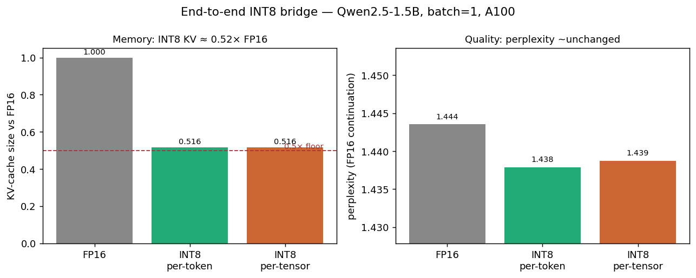
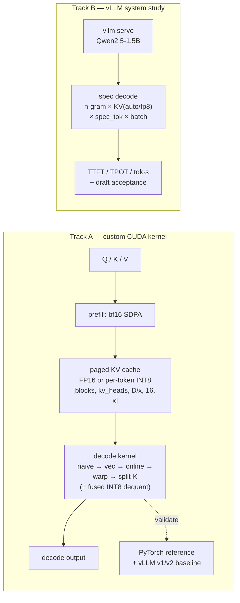

# cuda-PA-INT8

**A from-scratch CUDA PagedAttention decode kernel with per-token INT8 KV-cache
quantization — ~2× smaller KV cache at unchanged perplexity — plus a vLLM
speculative-decoding study.**
**从零实现的 CUDA PagedAttention 解码 kernel + per-token INT8 KV-cache 量化（显存减半、
困惑度几乎不变），外加 vLLM 投机解码系统基准。**

Motivation: vLLM has no native INT8 KV-cache (issues #33480, RFC #37319). This
project fills that gap at the kernel level. ·
动机：vLLM 原生不支持 INT8 KV-cache，本项目在 kernel 层补上这一块。

---

## Headline results · 核心结果

| | result | 结果 |
|---|---|---|
| **Kernel speed** | up to **102% of A100 HBM peak** (1591 GB/s) and **~100–115% of vLLM `paged_attention_v1`** at moderate batch | 长上下文大 batch 下达到 **HBM 峰值 102%**，约为 vLLM v1 的 100–115% |
| **INT8 KV memory** | **0.516×** FP16 (a **48.4%** cut), end-to-end on Qwen2.5-1.5B | 端到端 **0.516×** FP16 显存（减 48.4%） |
| **INT8 quality** | perplexity **1.438 vs 1.444** (FP16) — essentially unchanged | 困惑度 **1.438 vs 1.444**，几乎无损 |
| **Ablation** | per-token mean rel-err consistently **below** per-tensor | per-token 量化误差始终低于 per-tensor |



Full write-up: **[report/benchmark_report.md](report/benchmark_report.md)**
(PDF: `bash report/build_pdf.sh`) · 完整报告见此。

---

## Architecture · 架构



Five kernel stages, each correctness-checked vs a PyTorch reference before timing;
the INT8 read path **fuses dequant inline** (the per-token scale factors out of the
QK dot product, so there is no separate dequant pass). GQA/MQA supported and tested.

五级优化 kernel，每级都先对齐 PyTorch 参考实现再计时；INT8 读取路径**内联融合反量化**
（per-token scale 从 QK 点积中提出，无需单独反量化）。支持并测试 GQA/MQA。

---

## Reproduce · 复现

Built and run on **UIUC iCRN**: 1× A100-SXM4-80GB (sm_80), driver 570.211.01
(CUDA 12.8), conda. The custom kernels need `nvcc`, so the env uses conda's
`cuda-toolkit` matching torch.

```bash
bash setup.sh                  # conda env 'specdec' = vllm 0.19.1 + matching nvcc
source env.sh                  # activate, set sm_80 arch + HF_HOME

pytest tests/                  # correctness vs PyTorch reference (CPU + CUDA)

python benchmarks/bench_paged_decode.py       # kernel sweep   -> report/kernel_optimization.md
python benchmarks/bench_int8_quant.py         # INT8 kernel    -> report/int8_quant.md
python benchmarks/int8_bridge/run_bridge.py   # e2e INT8 bridge-> report/int8_bridge.md
python benchmarks/specdec/run_matrix.py       # spec decode    -> report/specdec_benchmark.md

bash report/build_pdf.sh       # regenerate figures + benchmark_report.pdf
```

CPU-only machines (incl. CI) run the pure-torch reference tests:
`pytest tests/test_quant.py tests/test_paged_decode_attn.py::test_reference_matches_dense`.

---

## Layout · 目录

```
kernels/      # CUDA sources: paged_attention_v{1..6}*.cu (.cu/.cuh)
tests/        # pytest — correctness vs PyTorch reference (CPU ref + CUDA kernels)
benchmarks/   # kernel microbenchmarks + int8_bridge/ + specdec/ harnesses
report/       # benchmark_report.md/.pdf, per-track reports, figures/, make_figures.py
```

See **[CLAUDE.md](CLAUDE.md)** for the full technical spec.
