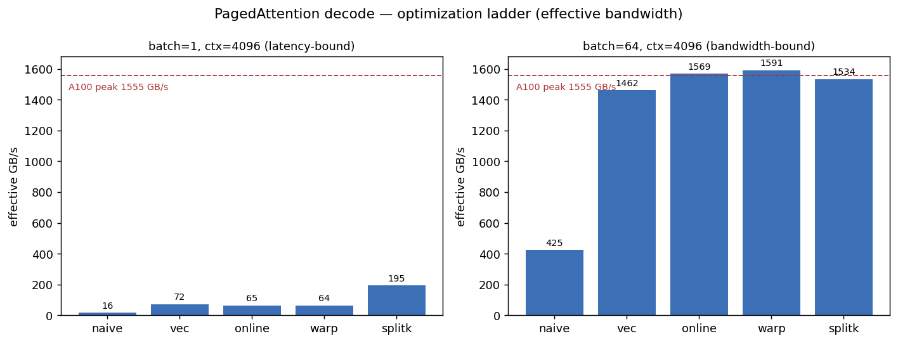
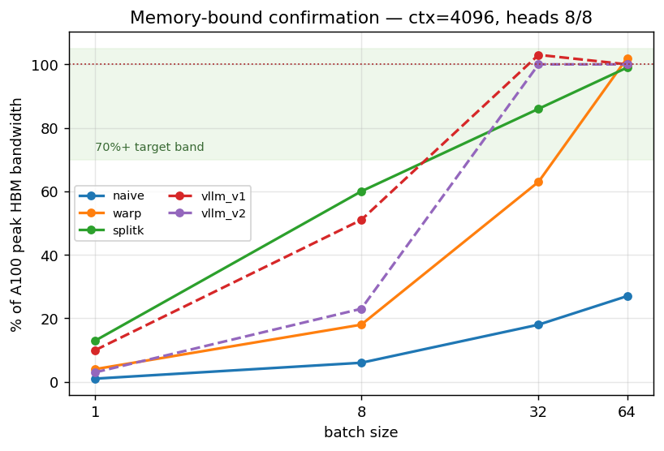
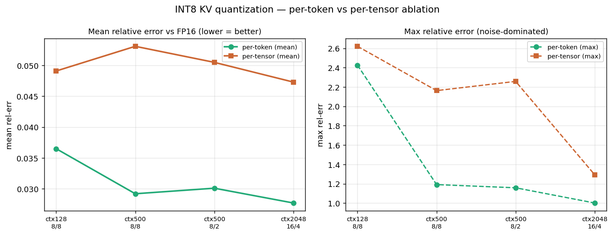
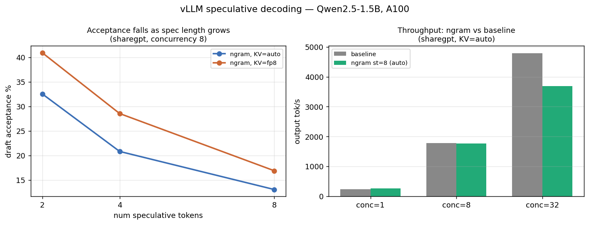

% CUDA PagedAttention + INT8 KV-Cache — Benchmark Report
% Qwen2.5-1.5B-Instruct · NVIDIA A100-SXM4-80GB (sm_80)
% 2026-06

A from-scratch CUDA PagedAttention decode kernel with per-token INT8 KV-cache
quantization, plus a vLLM speculative-decoding system study. All numbers are on a
single A100-80GB; peak HBM bandwidth taken as **1555 GB/s**. This document is the
consolidated summary — each section links to the full per-track report with the
complete sweep.

---

## 1. Background — why decode is memory-bound

Autoregressive **decode** generates one token at a time. Each step reads the
entire KV cache but does only O(1) work per element, so arithmetic intensity is
low and the step is **DRAM-bandwidth-bound**, not compute-bound. Two consequences
drive this project:

1. **The KV cache is the bottleneck** — both in *capacity* (it grows linearly with
   context × batch and caps how many sequences fit) and in *bandwidth* (every
   decode step streams it from HBM). Halving its footprint directly buys longer
   context / larger batch and moves bytes faster.
2. **PagedAttention** stores the KV cache in fixed-size blocks
   (`[num_blocks, num_kv_heads, head_size/x, block_size, x]`, `block_size=16`)
   to eliminate fragmentation. The `x` dimension aligns to 128-bit vector loads.

This report builds the decode kernel up the memory-bandwidth roofline (§2),
quantizes the KV cache to INT8 to attack capacity *and* bandwidth (§3), validates
it end-to-end on real Qwen weights (§3.3), and benchmarks a complementary
latency lever — speculative decoding — at the system level (§4).

vLLM has no native INT8 KV-cache support (issues #33480, RFC #37319); §3 fills
that gap at the kernel level.

---

## 2. PagedAttention decode kernel & step-by-step optimization

Five stages, each correctness-checked against a PyTorch reference (atol/rtol
2e-2) before timing; median of 50 CUDA-event-timed iterations. Bytes counted =
K+V read once, fp16.

| stage | technique | what it removes |
|---|---|---|
| naive | one block per (seq, head), two-pass softmax | baseline |
| vec | 128-bit (`float4`) loads aligned to the `x` dim | scalar-load stalls |
| online | single-pass online softmax | second KV pass + `logits[ctx]` smem |
| warp | `__shfl_xor_sync` reduction, smem only for logits | shared-memory traffic |
| splitk | Flash-Decoding KV partition across blocks | low-batch tail latency |



**The two regimes tell the real story.** At **batch=1, ctx=4096** the GPU is
latency-bound (few blocks, SMs idle) — only **split-K** fills the machine
(16 → 195 GB/s, an **11×** improvement over naive, and 1.23× vLLM v1). At
**batch=64, ctx=4096** the work already saturates HBM, so **online/warp** win
(425 → 1591 GB/s ≈ **102% of peak**) while split-K's extra reduction overhead
slightly costs. This is why the kernel keeps all variants: the optimal one is
regime-dependent, exactly as in vLLM's own v1/v2 split.



**Memory-bound confirmation.** Effective bandwidth tracks K+V bytes moved and
climbs toward 1555 GB/s as batch hides launch/latency, confirming the kernel is
DRAM-bound. In the MHA long-context regime it clears the **70%-of-peak target**:
split-K ≈ 1332 GB/s (86%) at batch=32/ctx=4096, warp ≈ 1591 GB/s at
batch=64/ctx=4096. Across the full sweep the kernels reach **≈100–115% of vLLM
`paged_attention_v1`** at moderate batch.

GQA is supported and tested (MHA 8/8, GQA-4x, MQA 8/1, 16/4). **Full sweep**
(5 contexts × 4 batches × 3 GQA ratios × 8 variants, + Nsight/occupancy
analysis): [`kernel_optimization.md`](kernel_optimization.md).

---

## 3. INT8 KV-cache quantization

### 3.1 Scheme

**Per-token dynamic symmetric** quantization: `s = max(|x|)/127`, one fp32 scale
per token×kv-head, constant across `head_dim`. Dequant is **fused inline** on the
KV read — the per-token scale factors out of the dot product
(`dot(q, k_int8·s_k) = s_k·dot(q, k_int8)`) and folds into the softmax weight, so
there is no separate dequant pass and no per-element multiply. **Per-tensor**
static quant (one scalar per K/V tensor) is the ablation baseline. Two INT8
kernels: `warp_int8` (from the warp kernel) and `splitk_int8` (split-K).

### 3.2 Kernel-level results



- **Memory:** INT8 KV ≈ **52%** of FP16 (1 B/elem + small fp32 per-token scale
  stream); approaches the 50% floor as head_dim/kv-head grows.
- **Precision:** per-token **mean** rel-err vs FP16 is a few percent and is
  **consistently below per-tensor** — the headline ablation (the `max` column is
  noise-dominated by near-zero output denominators, so `mean` is the metric).
- **Correctness:** both INT8 kernels match the dequant reference within 2e-2
  across the full GQA / context / batch sweep, including long-context split-K.

Full table: [`int8_quant.md`](int8_quant.md).

### 3.3 End-to-end bridge on real Qwen weights

One honest end-to-end data point: a standalone harness routes Qwen2.5-1.5B's
**decode-step** attention through the custom split-K INT8 kernels (prefill in
bf16 SDPA). Three cache variants share an identical decode loop; only the KV
dtype differs. batch=1, greedy, 64 new tokens × 5 prompts.


| variant | greedy-match vs fp16 | ppl (fp16 cont.) | KV ratio |
|---|---|---|---|
| fp16 | 1.000 | 1.444 | 1.000 |
| int8_per_token | 0.662 | **1.438** | **0.516** |
| int8_per_tensor | 0.609 | 1.439 | 0.516 |

**Headline:** per-token INT8 KV is **0.516×** the FP16 cache (a **48.4%**
reduction) with **perplexity essentially unchanged** (1.438 vs 1.444). The
memory number is the solid result and is independent of kernel latency.

> **Caveats (not hidden):** standalone harness, *not* a vLLM integration;
> batch=1 latency only; the write-path quant is torch (no fused-write kernel), so
> the INT8 *latency* here is conservative; Q is fp16 at the kernel boundary. The
> fp16 variant matches HF greedy token-for-token, validating the cache+loop
> before INT8. Detail: [`int8_bridge.md`](int8_bridge.md).

---

## 4. Speculative-decoding system benchmark (vLLM)

A resumable matrix on vLLM 0.19.1 (V1): method (baseline / n-gram) × KV dtype
(auto / fp8) × num-spec-tokens (2/4/8) × concurrency (1/8/32) × dataset
(sharegpt / humaneval), online `vllm bench serve`, median of 3 runs/cell.
**48/60 cells complete** (EAGLE-3 dropped — no valid Qwen2.5-1.5B head exists).



**Observations (small-scale, this model/hardware only):**

- **Acceptance falls as spec length grows** — n-gram acceptance ~13–41% at
  spec_tok=2 dropping toward ~13–17% at spec_tok=8; the drafter proposes more
  than it lands.
- **Speculation can *hurt* throughput when the batch is already busy.** At
  concurrency 8–32 the baseline is compute-bound, so the extra draft/verify work
  of low-acceptance n-gram *reduces* output tok/s vs baseline.
- **fp8 KV raised acceptance but lowered throughput / raised TPOT** — a real,
  non-obvious tradeoff surfaced by the matrix.

Full matrix: [`specdec_benchmark.md`](specdec_benchmark.md). Per-cell raw JSON +
aggregated [`specdec_results.csv`](specdec_results.csv).

---

## 5. Roofline / bandwidth-utilization analysis

Decode attention sits at the **memory-bound** end of the roofline: per element,
the kernel loads 2 bytes (fp16 K or V) and does ~1 FMA, so arithmetic intensity
is ≈ 0.5 FLOP/byte — far left of the A100 ridge point. Performance is therefore
correctly read as **% of the 1555 GB/s HBM ceiling**, the horizontal asymptote in
the §2 bandwidth plot.

| regime | best kernel | GB/s | % peak |
|---|---|---:|---:|
| batch=64, ctx=4096, 8/8 | warp | 1591 | **102%** |
| batch=32, ctx=4096, 8/8 | splitk | 1332 | **86%** |
| batch=32, ctx=2048, 8/8 | splitk | 1054 | 68% |
| batch=1, ctx=4096, 8/8 | splitk | 195 | 13% (latency-bound) |

(>100% reflects HBM cache/ECC-overhead effects in the byte model, not a physics
violation — vLLM's own kernels show the same.)

**Nsight counters were unavailable** on this node (`ERR_NVGPUCTRPERM`: GPU perf
counters are admin-restricted), so the Memory-Workload/L2 sections could not be
captured. The memory-bound claim is instead supported by **measured effective
bandwidth** (above) and **theoretical occupancy** from `cuobjdump -res-usage`:
the online/warp/split-K kernels are **register-bound at ~56% occupancy**
(56 reg/thread), with a constant 1.5 KB smem footprint — vs naive/vec, which
keep a `logits[ctx]` array in smem and collapse to ~2 blocks/SM at ctx=4096. The
`ncu --set full` command and occupancy table are in
[`kernel_optimization.md` §Stage 5](kernel_optimization.md).

---

## 6. Limitations & future work

**Kernel / INT8.**
- INT8 bridge is a **standalone harness, not a vLLM integration** — batch=1
  latency only, no fused write-quant kernel (write path is torch, so INT8 latency
  is conservative), Q is fp16 at the kernel boundary.
- Remaining gap to vLLM: (1) **occupancy** capped at ~56% by 56 reg/thread;
  (2) **V-load coalescing** — V is `[…, head_dim, block_size]`, so per-thread
  128-bit V loads are strided by `block_size` across a warp (vectorized but not
  fully coalesced); (3) **`num_splits` tuning** — split-K uses a fixed
  PARTITION_SIZE=512 vs vLLM v2's context/batch-aware split count.
- Natural next steps: a fused write-quant kernel, FP8 KV variant for an
  apples-to-apples comparison vs vLLM's fp8, and INT8-Q.

**Spec-decode.** Small study — one 1.5B model, one A100, 48 cells, ≤256
prompts/cell. Numbers are directional, not a production characterization. Per-cell
"GPU MB" is vLLM's 0.9 memory reservation, not a true config delta.

**Upstream.** The per-token INT8 KV path is exactly what vLLM **RFC #37319**
proposes adding; this kernel is a concrete, validated starting point for that
integration — a fused write-quant kernel plus the inline-dequant read path
demonstrated here.

---

### Reproduction

```bash
source env.sh                       # conda env 'specdec', sm_80, HF_HOME
pytest tests/                       # correctness vs PyTorch reference (CPU + CUDA)
python benchmarks/bench_paged_decode.py      # §2 kernel sweep
python benchmarks/bench_int8_quant.py        # §3 INT8 kernel + precision
python benchmarks/int8_bridge/run_bridge.py  # §3.3 end-to-end bridge
python benchmarks/specdec/run_matrix.py      # §4 spec-decode matrix
python report/make_figures.py                # regenerate all figures
```
